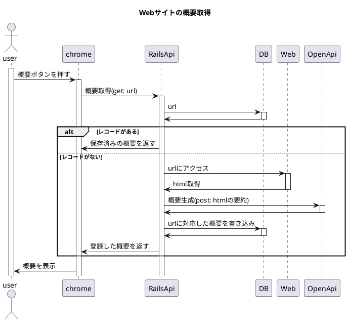

# Webサイトの概要取得シーケンス

```plantuml
@startuml
title Webサイトの概要取得

actor user
Participant chrome as chrome
Participant RailsApi as server
Participant DB as db
Participant Web as web
Participant OpenApi as openapi

activate user
user -> chrome : 概要ボタンを押す
activate chrome
chrome -> server : 概要取得(get: url)
activate server
server -> db : url
activate db
db -> server
deactivate db
alt レコードがある
server -> chrome : 保存済みの概要を返す
else レコードがない
server -> web : urlにアクセス
activate web
web -> server : html取得
deactivate web
server -> openapi : 概要生成(post: htmlの要約)
activate openapi
  openapi -> server
deactivate openapi
server -> db : urlに対応した概要を書き込み
activate db
db -> server
deactivate db
server -> chrome : 登録した概要を返す
end
chrome -> user : 概要を表示

@enduml
```
